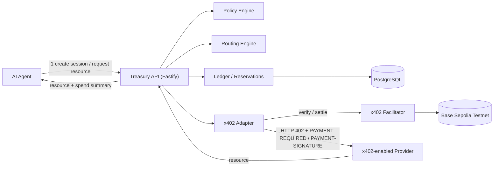
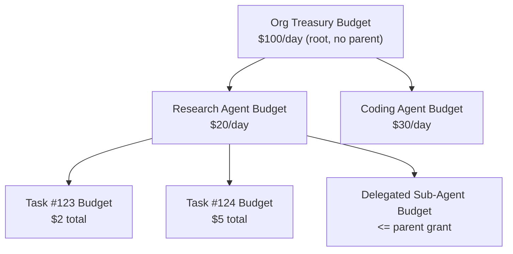

# x402 Treasury

[](https://github.com/ethankim02/x402-treasury/actions/workflows/ci.yml)

**Programmable spending infrastructure for autonomous AI agents.**

x402 allows autonomous software to pay for resources. x402 Treasury adds
the control plane required to manage autonomous spending safely — across
budgets, policies, concurrency, retries, routing, and settlement.

- **106 automated tests** (74 unit + 32 integration against real Postgres)
- **Real Base Sepolia x402 settlement**, verified on-chain — [tx
  `0x1b5636aa…e3a560`](https://sepolia.basescan.org/tx/0x1b5636aa3c8cecbac39851ce9bb71f2d116f15da992a4997fe6bfeb7c4e3a560)
- **$1.00 budget, 10 concurrent $0.50 requests → exactly 2 succeed**, $0
  overspend, proven under real Postgres load
- **PostgreSQL-backed append-only ledger** — `UPDATE`/`DELETE` revoked at
  the database privilege level, not just enforced in application code


## Why this exists

x402 v2's own specification is explicit about its boundaries: _"Out of
Scope: this specification does not include client-side budget
management, session handling mechanisms, [or] spending policy and
correlation tracking"_ (verified against the current spec — see
[`docs/RESEARCH.md`](docs/RESEARCH.md)). x402 answers _"can this specific
signed payment be settled."_ It has nothing to say about _"should this
agent be allowed to spend this money at all, right now, on this
provider."_ That second question — under concurrency, under retries,
across a crash, with money that isn't actually yours (it's your
organization's) — is what this project is about.

## Architecture



Full sequence diagram, ER diagram, budget-hierarchy diagram, and the
accounting invariant behind them: [`docs/ARCHITECTURE.md`](docs/ARCHITECTURE.md).

## Key engineering problems this project solves

- **Atomic hierarchical budget reservation** — `SELECT ... FOR UPDATE`
  locks a budget's entire ancestor chain (task → agent → org), root-first,
  inside one transaction, so a leaf spend can never exceed what any
  ancestor actually has left. Proven under real concurrent load, not
  simulated: 10 parallel $0.50 reservations against a $1.00 budget yield
  exactly 2 successes.
- **Idempotent payment execution** — a client-supplied `Idempotency-Key`,
  claimed via a unique-constraint race, means 5 identical retries after a
  timeout produce exactly one logical payment, not five.
- **Append-only accounting** — a `CHECK`-constrained invariant
  (`available + reserved + spent = allocated`) plus a journal whose
  `UPDATE`/`DELETE` privileges are revoked from the runtime role at the
  database level, not just by application convention (verified directly
  against Postgres, not assumed).
- **Delegated agent budgets** — a child agent's budget is just another
  node in the same hierarchy; it structurally cannot spend more than it
  was delegated, or more than its parents can still afford, and a
  database trigger rejects a cycle even via raw SQL.
- **Cost-aware routing** — a documented, non-hidden weighted-scoring
  formula over real provider metrics, not an ML model with nothing to
  learn from.
- **Settlement reconciliation** — a payment stuck in an uncertain state
  (facilitator `settlement_pending`, or a crash between a decision and
  its side effect) is resolved by a dedicated job and recorded in an
  audit trail, never silently mutated.
- **Real x402 v2 integration** — verified against the actual protocol
  spec and the actual installed `@x402/*` packages, including a header
  rename (`PAYMENT-REQUIRED`/`PAYMENT-SIGNATURE`) that a lot of
  copy-pasted v1 tutorials get wrong.

## Quick start

```bash
pnpm install
cp .env.example .env
docker compose up -d      # Postgres — or point DATABASE_URL at your own instance
pnpm db:migrate
pnpm db:seed               # optional — the demo scripts create their own org anyway
```

```bash
pnpm demo:research         # one end-to-end payment, real HTTP, polished output
pnpm demo:failures         # budget-exceeded, duplicate-retry, concurrency, reconciliation
```

Both demo commands spawn the Treasury API and two demo x402 providers as
real local processes and talk to them over real HTTP — see
[`docs/DEMO.md`](docs/DEMO.md) for exactly what happens and sample
output.

## MOCK PAYMENT DEMO

Real HTTP, real policy/ledger/routing logic — settlement is simulated by
an in-memory mock facilitator. **No blockchain transaction of any kind
occurs.** This is what CI and both `pnpm demo:*` commands run.

```
x402 Treasury Demo
────────────────────────────────────────────────────────
Providers discovered: 3
Provider C (balanced)            $0.015 |  672ms | 100.0% | score=0.1895
Provider A (cheap, slow)         $0.010 | 1526ms | 100.0% | score=0.3000
Provider B (expensive, fast)     $0.030 |  309ms | 100.0% | score=0.4000

Routing
Selected: Provider C (balanced)

Payment
Policy checks
✓ SESSION_BUDGET_LIMIT  ✓ PER_TRANSACTION_LIMIT  ✓ UNKNOWN_PROVIDER_LIMIT
✓ DUPLICATE_PAYMENT_WINDOW  ✓ PROVIDER_ALLOWLIST

Result
HTTP 200
Payment settled (mock): 0xMOCK77ea3bc2acb0f918cf5bc60ba45c7673b2734e020cba09ddffec0825b0

Budget
Allocated $1.000000   Spent $0.015000   Reserved $0.000000   Available $0.985000
```

`PAYMENT MODE: MOCK` is printed on every run of this command — never
mistake it for an on-chain settlement.

## REAL BASE TESTNET x402 DEMO

Separate from the mock demo above, and never conflated with it. Uses the
actual Base Sepolia testnet and a real x402 facilitator; moves worthless
testnet USDC, never mainnet funds.

**Current status: completed.** On 2026-09-26 one real payment was settled
on Base Sepolia through the **full** Treasury path — `POST
/payments/intents` → policy evaluation → atomic budget reservation →
`RealX402Adapter` → real `402` + `PAYMENT-REQUIRED` from a genuinely
x402-protected provider (`apps/demo-provider-a/src/real-server.ts`) →
EIP-3009 signature → the public `https://x402.org/facilitator` verifies and
settles on-chain → reservation capture and ledger entries. Nothing was
sent around Treasury and no hash is invented: the hash below is read from
the facilitator's `PAYMENT-RESPONSE` header and independently looked up on
the chain.

| Field                       | Value                                                                                                                                                   |
| --------------------------- | ------------------------------------------------------------------------------------------------------------------------------------------------------- |
| **Transaction hash**        | `0x1b5636aa3c8cecbac39851ce9bb71f2d116f15da992a4997fe6bfeb7c4e3a560`                                                                                    |
| **Explorer**                | [sepolia.basescan.org/tx/0x1b5636aa…e3a560](https://sepolia.basescan.org/tx/0x1b5636aa3c8cecbac39851ce9bb71f2d116f15da992a4997fe6bfeb7c4e3a560)         |
| Network                     | Base Sepolia (`eip155:84532`), chain ID 84532 — testnet only                                                                                            |
| Result on-chain             | `status 0x1` (Success), block 47322846, **2026-09-26 09:13:00 UTC**                                                                                     |
| Amount                      | **$0.001000 USDC** (1000 minor units, 6 decimals), `exact` scheme (EIP-3009 `transferWithAuthorization`)                                                |
| Payer / payTo               | both `0xa89C5fB293ade8a170735d16E6A31427375B0470` (a throwaway testnet key; the payment is a self-transfer, so the wallet's USDC stays at 20.000000)    |
| Settled by                  | `0xd407e409E34E0b9afb99EcCeb609bDbcD5e7f1bf` — the x402.org facilitator's address (as advertised by its `/supported`); it broadcast the tx and paid gas |
| **Session balance before**  | allocated $0.050000 · spent $0.000000 · reserved $0.000000 · **available $0.050000**                                                                    |
| **Session balance after**   | allocated $0.050000 · spent **$0.001000** · reserved $0.000000 · **available $0.049000**                                                                |
| Payment intent              | `45ab3f67-3e3d-4643-b873-cb79b90d3bc0`: `CREATED → POLICY_EVALUATING → APPROVED → RESERVED → PAYMENT_PREPARED → VERIFYING → SETTLING → SETTLED`         |
| Treasury timestamps (local) | payment requested 2026-09-26T09:12:55.279Z · intent `SETTLED` 2026-09-26T09:12:56.794Z                                                                  |

Policy checks that passed before any money moved: `SESSION_BUDGET_LIMIT`,
`PER_TRANSACTION_LIMIT` ($0.01 cap), `PROVIDER_ALLOWLIST`. On BaseScan the
transaction shows a single ERC-20 transfer of 0.001 USDC (`Transfer` +
`AuthorizationUsed` logs) on the USDC contract
`0x036CbD53842c5426634e7929541eC2318f3dCF7e`.

The Treasury-side values above (balances, intent states, timestamps) were
copied from the API responses captured at run time; the local dev
database that held those rows was later reset, so only the on-chain
transaction is independently re-checkable — the row-level ledger entries
are not. The two clocks (local vs. block time) differ by a few seconds.

Reproduce it (needs a funded testnet wallet; see
[`docs/DEMO.md`](docs/DEMO.md) "REAL BASE TESTNET x402 DEMO" for every
step and environment variable):

```bash
pnpm --filter @x402-treasury/x402-adapter run testnet:check    # reaches x402.org/facilitator, eip155:84532 + exact supported
pnpm --filter @x402-treasury/x402-adapter run testnet:wallet   # throwaway key -> .env only, prints the public address
# fund that address with testnet USDC at https://faucet.circle.com (Base Sepolia); no ETH needed
X402_REAL_PAYTO_ADDRESS=0xYourAddress pnpm --filter @x402-treasury/demo-provider-a run start:real
X402_ADAPTER_MODE=real pnpm dev:api                            # logs "PAYMENT MODE: REAL BASE TESTNET"
```

then register an org/agent/session/provider and `POST /payments/intents`.
Getting this to run required two adapter fixes that the earlier
"verified-but-not-exercised" state had hidden: `RealX402Adapter` now reads
the authoritative price from the real `PAYMENT-REQUIRED` header
(`discoverRequirements` used to throw), and takes the transaction hash from
the `PAYMENT-RESPONSE` header (it used to return none). Both are covered by
`packages/x402-adapter/src/real-adapter.test.ts`, which drives the real SDK
signing path against a local stand-in server with no network access.

## Budget hierarchy



A reservation locks and checks **every** budget on this tree from root to
leaf in one transaction — spending at a leaf simultaneously consumes
capacity at every ancestor. See [`docs/ARCHITECTURE.md`](docs/ARCHITECTURE.md)
§4 for the exact invariant and why this isn't classic double-entry
bookkeeping (and [`docs/DECISIONS.md`](docs/DECISIONS.md) ADR-004 for the
alternative considered and rejected).

## Failure handling

Every failure mode below is exercised by `pnpm demo:failures` against the
real running system, and by the automated test suite against real
Postgres — not asserted, demonstrated:

| Scenario                                                                  | What happens                                                                        |
| ------------------------------------------------------------------------- | ----------------------------------------------------------------------------------- |
| Session budget too small for the live-quoted price                        | `402` + `SESSION_BUDGET_EXCEEDED`, **zero** funds reserved                          |
| Same `Idempotency-Key` retried 5 times                                    | One logical payment intent; retries 2–5 replay the original response                |
| 10 concurrent $0.50 requests against a $1.00 budget                       | Exactly 2 succeed, 8 fail deterministically, budget never goes negative             |
| Settlement lands in an uncertain state                                    | Reservation stays `reserved` (not lost, not spent) until reconciliation resolves it |
| Reconciliation can't determine the outcome                                | Marked `MARKED_FOR_REVIEW`, not guessed                                             |
| A process crashes between "decided FAILED" and "released the reservation" | The next reconciliation run finds and repairs it                                    |
| Delegated child tries to overspend its own grant                          | Blocked by the same reservation the parent's own spending goes through              |

Full reasoning: [`docs/ARCHITECTURE.md`](docs/ARCHITECTURE.md) §5 (state
machine) and §7 (reconciliation).

## Tests

```bash
pnpm test               # 74 unit tests — no database
pnpm test:integration   # 32 integration tests — real Postgres (docker compose up -d first)
```

The concurrency test is the one worth reading directly:
[`packages/ledger/test/concurrency.integration.test.ts`](packages/ledger/test/concurrency.integration.test.ts).
It launches 10 genuinely concurrent reservation attempts against a real
Postgres instance and asserts the budget invariant holds — this is the
test that actually proves the locking strategy in
[`docs/ARCHITECTURE.md`](docs/ARCHITECTURE.md) §4.4, not just documents
it.

CI (`.github/workflows/ci.yml`) runs lint, format check, typecheck, unit
tests, and the full integration suite against a real Postgres service
container on every push.

## x402 integration

This project verified the current x402 v2 protocol and the actual
installed `@x402/*` packages before writing any adapter code — see
[`docs/RESEARCH.md`](docs/RESEARCH.md) for primary sources, exact
verified package versions, and a real deviation from widely-copied v1
tutorials (the `X-PAYMENT`/`X-PAYMENT-RESPONSE` headers were renamed to
`PAYMENT-REQUIRED`/`PAYMENT-SIGNATURE` in v2).

Two adapters implement one `PaymentRail` interface
([`docs/DECISIONS.md`](docs/DECISIONS.md) ADR-007):

- **`MockX402Adapter`** — used by CI, `pnpm test:integration`, and both
  demo commands. Performs **real HTTP requests with the real x402 v2
  header names** against a real local resource server; only the
  signature itself and the settlement are simulated (no blockchain). This
  is what makes `PAYMENT MODE: MOCK` appear on every demo run — it is
  never claimed to be a real settlement.
- **`RealX402Adapter`** — Base Sepolia only (hard-refuses any other
  network in code, not just configuration), using the actual installed
  `@x402/fetch`/`@x402/evm` packages (`wrapFetchWithPayment`, `x402Client`,
  `ExactEvmScheme` — read directly from the installed packages' `.d.ts`
  files, not guessed). `apps/api` switches to it only when
  `X402_ADAPTER_MODE=real` is explicitly set (`apps/api/src/config.ts`
  refuses to start in that mode without both `X402_FACILITATOR_URL` and
  `X402_PAYER_PRIVATE_KEY`). Exercised manually only — one real Base
  Sepolia settlement has been completed through it (see
  [REAL BASE TESTNET x402 DEMO](#real-base-testnet-x402-demo) above for the
  transaction hash and explorer link); **CI never runs this path** (its
  header parsing is unit-tested against a local stand-in server instead)
  and this README does not claim otherwise.

## Limitations

- `RealX402Adapter` has been exercised end-to-end exactly once (a $0.001
  Base Sepolia settlement, see above) and only manually — no automated
  test or CI job touches a live facilitator or chain. Its
  `settlePayment` reports a failure (and Treasury releases the
  reservation) if a paid response carries no `PAYMENT-RESPONSE`
  settlement header, even in the unlikely case the facilitator had
  already settled; that fail-safe direction has not been exercised
  against the live facilitator.
- No production-grade auth (API keys are SHA-256-hashed bearer tokens,
  no rotation/expiry/scoping beyond org-vs-agent).
- No request-rate limiting at the HTTP layer.
- `upto` and `batch-settlement` x402 schemes, and non-EVM networks, are
  not implemented.
- Human-approval `REVIEW` decisions from the policy engine are reported
  to the caller but there's no resume-after-approval flow yet — treated
  the same as a block for now.
- See [`docs/THREAT_MODEL.md`](docs/THREAT_MODEL.md) §4 for an explicit
  list of what this project does **not** claim to do (no fraud detection,
  no provider-identity verification, no resource-quality guarantee).

## Deliberately out of scope

Payment correctness came first. Not built, on purpose: a dashboard UI, a
full user/identity system, and scheduled background jobs (reservation
expiry, reconciliation) for what today are callable functions run
on demand. Full list and rationale: [`docs/ROADMAP.md`](docs/ROADMAP.md).

## Repository layout

```
apps/
  api/                Treasury REST API (Fastify)
  demo-agent/          CLI that drives the whole system over real HTTP
  demo-provider-a/      x402-enabled demo paid API (cheap/slow + balanced tiers)
  demo-provider-b/      x402-enabled demo paid API (expensive/fast)
packages/
  shared/              Money type, IDs, error/reason-code vocabulary, clock
  db/                  Hand-written SQL migrations + Drizzle schema + seed
  ledger/              Append-only ledger, atomic reservations, state machine, reconciliation
  policy-engine/       Composable, pure spending-policy rules
  router/              Deterministic cost-aware provider routing
  x402-adapter/        PaymentRail interface + mock/real implementations
docs/
  RESEARCH.md          Primary-source x402 v2 protocol research
  ARCHITECTURE.md      Domain model, ER diagram, accounting invariant, state machine
  DECISIONS.md         ADRs
  ROUTING.md           Routing formula and worked example
  THREAT_MODEL.md      Threats and mitigations
  DEMO.md              Demo walkthrough with sample output
```

## License

MIT — see [`LICENSE`](LICENSE).
