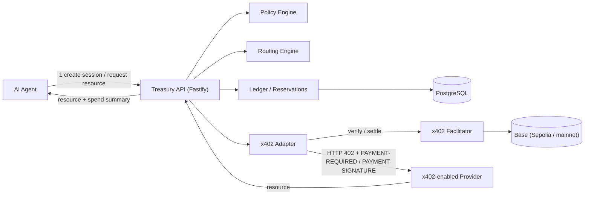
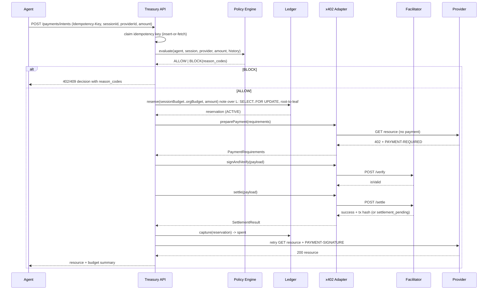
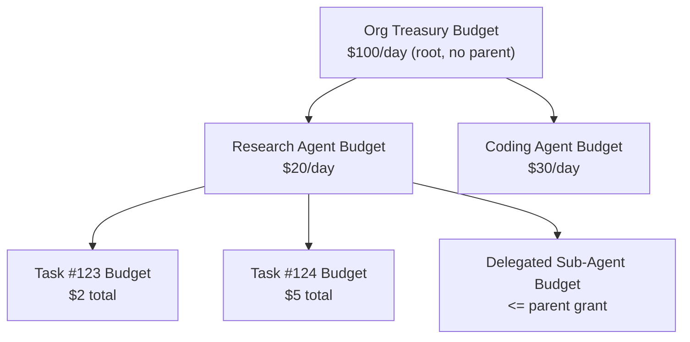
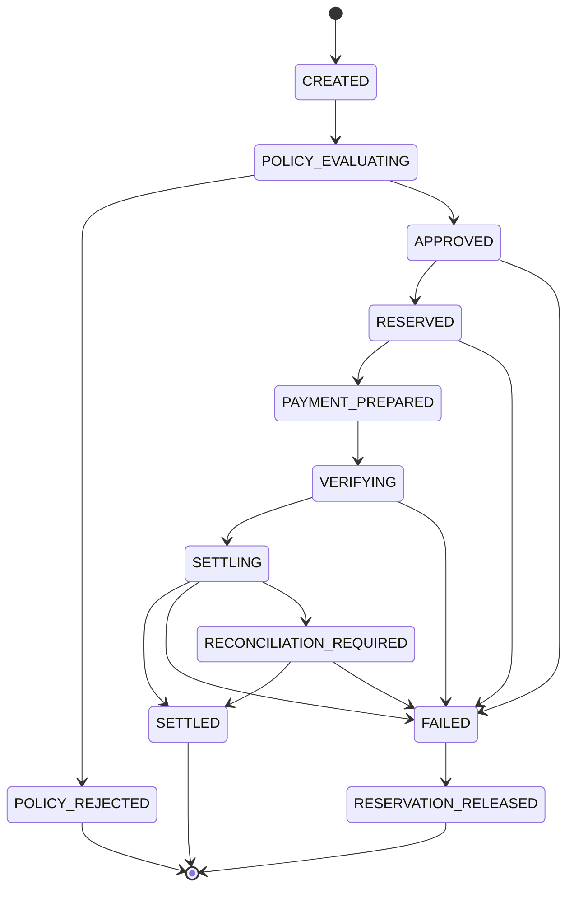
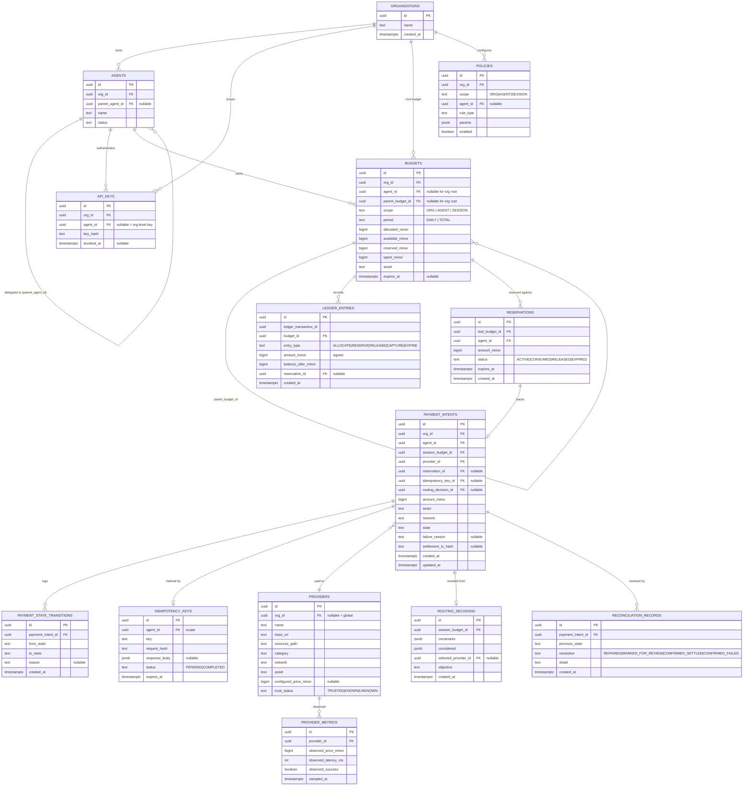

# Architecture

## 1. System overview



Treasury sits **between** the agent and the paid resource. The agent never
talks to a provider directly for a metered resource — it asks Treasury for
a decision, Treasury reserves funds, drives the x402 handshake through the
adapter, and returns the resource plus a spend summary. This is what makes
budgets, policy, routing, and idempotency enforceable in one place instead
of being the agent's responsibility.

## 2. Payment sequence (happy path)



## 3. Budget hierarchy



Every budget node except the org root has exactly one `parent_budget_id`.
This is a **tree**, not an arbitrary graph — cycles are structurally
impossible for newly-created budgets (a child always points to an
already-existing parent). The one place a cycle could theoretically be
introduced is re-parenting an existing budget; the API does not expose
re-parenting at all in the MVP, so cycle-prevention is enforced by
**not implementing the only operation that could create one** — see
`docs/DECISIONS.md` ADR-004 for why this is preferred over a runtime graph
cycle-check for a feature that doesn't otherwise exist yet, and the
delegation tests still verify that (a) a budget cannot name itself or a
descendant as its own parent if/when re-parenting is added, and (b) a
child's effective ceiling can never exceed what its ancestors allow.

## 4. Accounting model

### 4.1 Why not a single mutable `balance` column

Computing `available = allocated - SUM(payments)` on every request is
unsafe under concurrency (two readers can both observe "available" stock
before either writes) and throws away history. x402 Treasury instead keeps
**both**:

1. An append-only `ledger_entries` journal — the audit trail, never
   updated or deleted (enforced by a Postgres rule that revokes `UPDATE`
   and `DELETE` for the application role).
2. A `budgets` row per budget node holding three **materialized, always
   consistent** counters: `available_minor`, `reserved_minor`,
   `spent_minor`. These are not a cache that can drift — they are updated
   in the _same transaction_ as the journal insert that explains the
   change, so they are always exactly derivable by replaying that budget's
   journal. Reconciliation can and does recompute them from the journal
   as a correctness check (see §7).

### 4.2 Invariant

For every budget row:

```
available_minor + reserved_minor + spent_minor = allocated_minor
available_minor >= 0, reserved_minor >= 0, spent_minor >= 0
```

This is enforced by a **Postgres `CHECK` constraint**, not just
application logic — a bug that tried to reserve more than available would
fail to even commit.

### 4.3 Hierarchical consumption (the actual "double-entry" decision)

The spec asked us to evaluate double-entry bookkeeping. Classic
double-entry models a _transfer between two accounts_ (debit one, credit
another, net zero). That doesn't describe this domain: allocating a child
budget doesn't move money out of the parent's spendable pool at allocation
time (an org can allocate $20/day to five agents even though its own cap is
$100/day — that's a soft ceiling per node, same as a real credit-limit
hierarchy, not a wallet transfer). The property that actually needs to hold
is different and stronger: **a single dollar spent by a task must
simultaneously consume capacity at every ancestor level**, so a leaf can
never spend money its parents don't actually have room for _at the moment
of spending_.

So instead of two-entry double-entry, x402 Treasury uses **balanced
multi-entry ledger transactions**: one reservation produces one
`ledger_entries` row **per ancestor budget** (task, agent, org — however
many levels exist), all sharing one `ledger_transaction_id`, all the same
`RESERVE` type and amount, all part of one Postgres transaction. Settling
or releasing does the same fan-out. This is auditable exactly like
double-entry (you can sum by `ledger_transaction_id` and by budget), but
it models "consume capacity up a hierarchy" rather than "move value between
two peers" — which is the operation this domain actually has. See ADR-004
for the alternative considered (per-pair transfer ledger) and why it was
rejected (it would require materializing a "parent's spendable-by-children"
sub-account that doesn't correspond to anything an operator configures).

### 4.4 Concurrency strategy

Reserving funds locks every budget row on the ancestor path with
`SELECT ... FOR UPDATE`, always acquired **root-to-leaf in ascending id
order**, inside a single `READ COMMITTED` transaction (Postgres default —
not `SERIALIZABLE`). All the balance reads and the `CHECK`-constrained
writes happen while those locks are held; the transaction commits or the
whole reservation aborts atomically.

- **Why pessimistic locking, not optimistic concurrency control:** the
  target scenario is deliberately high-contention (ten agents racing for
  the last $1 of budget). OCC would mean most of those ten retry at least
  once, and under enough contention some can starve; `FOR UPDATE` makes
  losers fail _once_, immediately, with a clear reason — a treasury system
  should say "no" fast and deterministically, not "try again."
- **Why not `SERIALIZABLE`:** the invariant depends only on the rows we
  explicitly lock. `SERIALIZABLE` would add abort-and-retry overhead for
  protection we don't need, since `FOR UPDATE` already provides the
  exclusion this specific operation requires.
- **Why a fixed lock order:** always locking root-to-leaf prevents
  deadlocks between two concurrent reservations that touch overlapping
  ancestor chains (e.g., two sibling tasks under the same agent both lock
  the org row, then the agent row, then their own distinct task row — never
  the reverse order).

The mandatory concurrency integration test
(`packages/ledger/test/concurrency.integration.test.ts`) launches 10
concurrent reservation attempts of $0.50 each against a $1.00 budget and
asserts exactly 2 succeed, the other 8 fail with `INSUFFICIENT_BUDGET`, and
the budget's `available_minor` never goes negative — checked both via the
API responses and via a direct row read after all 10 settle.

## 5. Payment intent state machine



Notes:

- `FAILED` means "Treasury has decided this payment will not settle."
  `RESERVATION_RELEASED` means "and the reservation backing it has been
  confirmed returned to `available`." They are separate states on purpose:
  if the process crashes between deciding `FAILED` and releasing the
  reservation, the reservation is still `ACTIVE` and the intent is
  `FAILED` — the reconciliation job (§7) finds exactly this combination,
  releases the reservation, and advances the intent to
  `RESERVATION_RELEASED`. This is how Scenario E ("settlement fails,
  reservation eventually becomes available again") is guaranteed even
  across a crash, not just in the synchronous happy path.
- `SETTLING -> RECONCILIATION_REQUIRED` models the facilitator's
  `settlement_pending` outcome and any client-observable timeout while
  talking to the facilitator — the payment may or may not have actually
  landed on-chain, and Treasury must not guess.
- Every transition is written in the same DB transaction as the domain
  effect it represents (e.g. `APPROVED -> RESERVED` and the reservation
  row insert + budget row updates are one transaction), and a
  `payment_state_transitions` audit row is appended for every transition,
  so the full lifecycle of any payment is reconstructable.
- Illegal transitions (e.g. `SETTLED -> CREATED`, or skipping straight from
  `CREATED` to `SETTLED`) are rejected by the state machine implementation
  itself (`packages/ledger/src/state-machine.ts`), independent of the
  database — see its unit tests for the full legal/illegal transition
  matrix.

## 6. Entity-relationship diagram



### 6.1 Deliberately-omitted tables

The task prompt lists a longer set of candidate nouns. These were
considered and folded into existing tables rather than given their own
table, with the reasoning:

- **Wallet** — Treasury never custodies a private key (ADR-007); the
  paying key lives only in the operator's environment for the real
  adapter. There is no wallet _record_ to store beyond a `payTo` address,
  which lives on `providers`/config, not a domain entity with its own
  lifecycle.
- **Task / Spending Session** — modeled as a `BUDGETS` row with
  `scope = 'SESSION'`, not a separate table, because a session _is_
  budget-shaped (allocated/available/reserved/spent, an expiry, a parent).
  Giving it its own table would mean duplicating the accounting columns
  and reconciling two representations of the same concept.
- **Payment Attempt** — the `exact` scheme this project implements is
  single-shot per signed payload; retries of the _same logical request_
  are idempotency replays (return the existing intent), not new attempts.
  The full lifecycle of one attempt is the `payment_state_transitions`
  log on the one `PAYMENT_INTENTS` row.
- **Settlement** — 1:1 with a payment intent in the `exact` scheme (no
  batch settlement implemented), so it's columns on `PAYMENT_INTENTS`
  (`settlement_tx_hash`, `state = SETTLED`) rather than a joined table.
- **Merchant vs. Service Endpoint** — the demo has one endpoint per
  provider, so they're the same row (`base_url` + `resource_path` on
  `PROVIDERS`). If a provider ever exposed multiple priced endpoints this
  would need to split; documented as a roadmap item, not built ahead of
  need (anti-goal #12: "don't build 50 abstractions before the first
  working payment").
- **User / Owner** — out of scope for the MVP; API keys are already scoped
  to an org or agent, which is sufficient to authorize spending decisions.
  A full user/identity system is listed under Roadmap in the README, not
  built speculatively.

## 7. Reconciliation

A payment can end up in an **uncertain** state for exactly two reasons in
this system:

1. The facilitator returned `settlement_pending` (broadcast succeeded,
   confirmation unknown) — intent is `RECONCILIATION_REQUIRED`.
2. The process crashed/timed-out between a state transition and its
   side-effect completing — e.g. intent says `FAILED` but the reservation
   row is still `ACTIVE`; or intent is stuck in `SETTLING` past a
   configured staleness window with no terminal state reached.

`packages/ledger/src/reconciliation.ts` (run via `pnpm reconcile` or the
`POST /reconciliation/run` endpoint) scans for both patterns and, for each:

- If authoritative settlement state is available (mock adapter: internal
  ledger; real adapter: re-query the facilitator/chain for the tx hash),
  repair the state deterministically and record a `RECONCILIATION_RECORDS`
  row with `resolution = REPAIRED`, `CONFIRMED_SETTLED`, or
  `CONFIRMED_FAILED`.
- If it cannot determine the true outcome (e.g. real adapter, chain query
  itself fails), it does **not** guess — it records `resolution =
MARKED_FOR_REVIEW` and leaves the intent in `RECONCILIATION_REQUIRED`.

No reconciliation path silently mutates a record without a corresponding
`RECONCILIATION_RECORDS` audit row — this is the project's "never silently
mutate financial state" rule made concrete.

## 8. MVP boundary

**In scope and implemented with tests:** hierarchical budgets and
reservations under concurrency, the policy engine, session budgets,
delegated agent budgets (single level and nested, with overspend/parent-cap
enforcement), idempotent payment intent creation, the full state machine,
cost-aware routing with an auditable decision log, a mock x402 adapter used
in CI plus a real adapter for a manually-run Base Sepolia demo, and
reconciliation for the two uncertain-state patterns above.

**Explicitly out of scope for v1** (see README Roadmap): the `upto` and
`batch-settlement` x402 schemes; non-EVM networks; a full user/auth system
beyond API keys; policy hot-reload without a redeploy; a general
budget-reparenting API (see §3); Prometheus scraping (an internal metrics
counter abstraction is implemented instead — see `packages/observability`).
